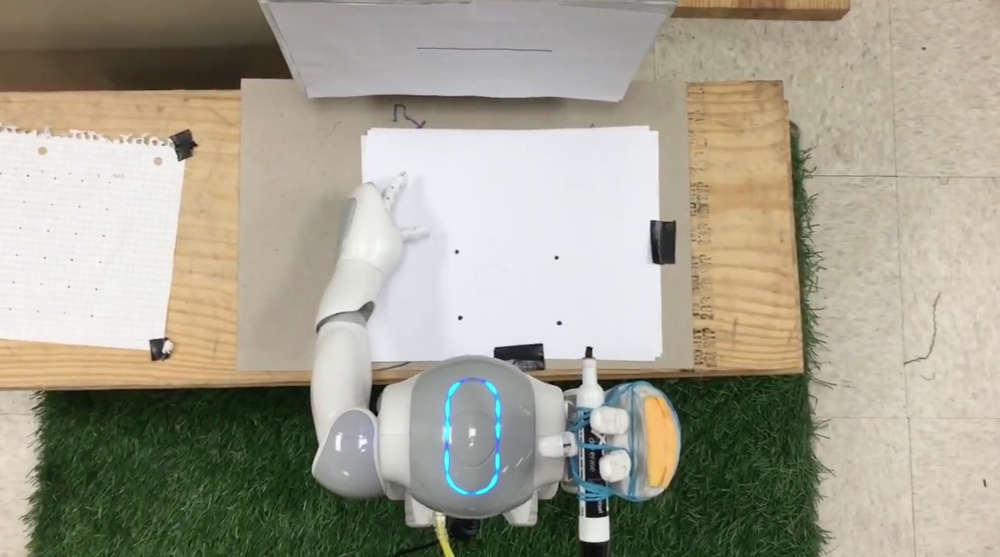
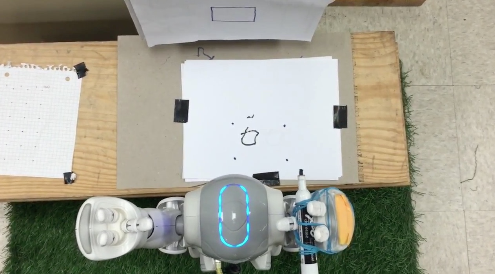
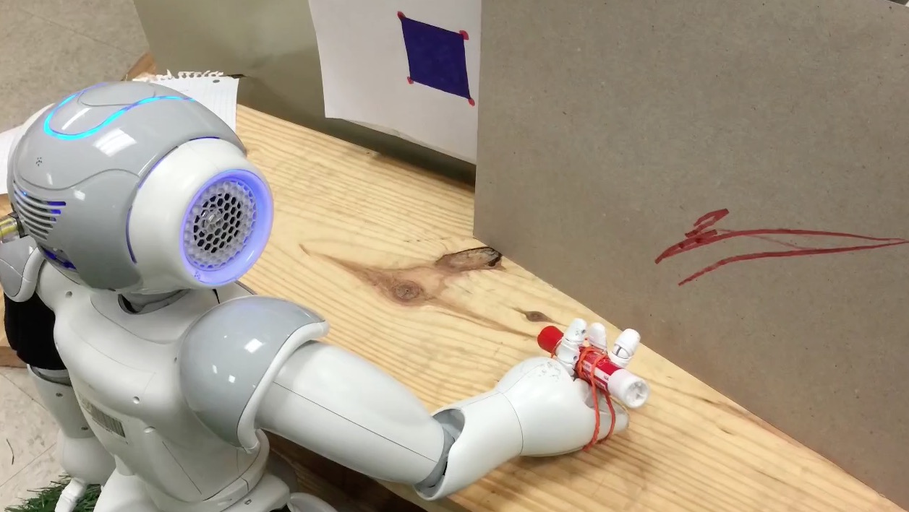

+++
title = "Drawing Shapes with NAO"
description = "This blog post discusses how to 'teach' the NAO robot to draw shapes that it 'sees' using NAOqi, Python and OpenCV."
slug = "drawing-shapes-with-nao"
date = "2015-05-09 20:18:28"

[extra]
author = "tjmaynes"
+++

This blog post discusses how to "teach" the NAO robot to draw shapes that it "sees" using NAOqi, Python and OpenCV. By the end of this blog post, you should have a better understanding of Canny Edge Detection and using Pixel Position interpolation to map a virtual space to Forward Kinematics.

## Background
I just graduated with a Computer Science degree and wanted to share my Robotics class project that I'm proud of working on. Movies like [Iron Man](https://www.imdb.com/title/tt0371746/) and [Terminator 2](https://www.imdb.com/title/tt0103064) have inspired me to learn more about Computer Vision and Robotics. So, for my last semester of college, I was pretty excited to enroll in the Robotics course taught by [Dr. Yu Sun](http://www.cse.usf.edu/~yusun/).

Dr. Sun had some very expensive robots including a programmable industrial "arm", the NAO Robot and some homegrown robots. Roughly 70% of Dr. Sun's Robotic course grade came from a semester long group project. [Tommy Lin](https://www.linkedin.com/in/tommylin1/), my classmate, and I decided to team up on the course project. Tommy and I decided that we could learn and implement some Computer Vision and Robotics concepts together using the NAO Robot. For our project, we decided to write software to teach the NAO robot to draw shapes it "sees" using NAO SDK, Python and OpenCV.

## Project Design
In order to program the NAO robot to draw basic shapes (seen through the camera sensor), some important design decisions needed to be examined at the beginning of this project. With the help of our course Teacher's Assistant, Caitrin Eaton, we decided these design pieces needed to include:

- Setting up a workspace for the NAO robot to physically work within.
- Understanding and implementing an edge detection algorithm to identify shapes.
- Mapping and interpolating the detected shapes (as pixel points) to points in the NAO's workspace.
- Debugging and testing how the NAO robot draws smooth lines.

### Setting up the Physical Workspace

We decided early on that we were going to use Forward Kinematics to move the NAO arm. Next, we came up with a general solution for describing lines and shapes in the form of a lookup table. The lookup table contains four coordinate positions (found in Figure 2) that make up a bounding area box area for the NAO to draw within. Since we are using the NAO robot's right arm, RArm, each one of the four coordinate positions are a list of six theta values/joint angles (`RShoulderPitch`, `RShoulderRoll`, `RElbowYaw`, `RElbowRoll`, `RWristYaw`, `RHand`).

Using this lookup table and the NAOqi `getAngles` function, we will enable the NAO robot to draw the shapes it sees within its workspace.

## Project Implementation
### Edge Detection
In order to implement edge detection using the NAO robot's camera, we first had PIL, Python Imaging Library. PIL allowed us to capture and save the image from the NAO's camera. Next, we read in the captured photo and used OpenCV's Canny Edge Detection function. The Canny Edge Detection algorithm is implemented in following order:

- We read the image created by PIL, called *noognagnook.png*, from disk by OpenCV's imread function. The `imread` function loads an image from file.
- The loaded image is now converted to black and white using OpenCV's `cvtColor` function. The `cvtColor` function coverts an image from one color space to another.
- The black and white image is now blurred using OpenCV's `GaussianBlur` function. The black and white image is blurred because we do not want any extra noise or else that noise will show up as a line in the edge detection. The `GaussianBlur` function blurs an image using a gaussian filter.
- The black and white blurred image is passed to OpenCV's Canny function. The Canny function creates a mask of thresholds/bright lines that represent our shapes seen by the NAO robot.
- The canny image is saved to a file for debugging.
- The canny image is now passed to a function called `findContours`. The `findContours` function returns a sets of Numpy arrays of pixel positions that make up each contour found in an image.
- For each contour found, we take a smaller number of points that it will take to make that contour by using OpenCV's `approxPolyDP`. The `approxPolyDP` function uses an alogrithm called [Douglas-Peucker algorithm](https://en.wikipedia.org/wiki/Ramer–Douglas–Peucker_algorithm) that will approximate a curve or a polygon with another curve/polygon with less vertices so that the distance between them is less or equal to the specified precision.
- Allow the NAO robot to draw a shape using the approximate number of points found at a current contour that creates a polygon.

Lots of testing was done to make sure that we were using the approriate number of points and the correct points to draw from. Now that we have edge detection setup properly, we can now interpolate the detected pixel position to our workspace by using a lookup table and bilinear interpolation.

## Pixel Position Interpolation
In order to interpolate the pixel positions found, we first had to setup a function called *lookup_table* to pass our desired pixel positions to and return a list of lists of theta values.

The lookup table created is a matrix of size: 640 columns by 460 rows (pixels from the camera sensor generated image). Next, we had to manually get our four bounding box points by setting the NAO's right arm stiffness to zero and calling `getAngles`, from the NAOqi API, on the specified grid coordinate. The four specified grid coordinates included: grid[0][0], grid[640][0], grid[0][460], and grid[640][460]. In each of the four specified grid coordinates, there contains a list of six theta values that represent how the NAO's right arm is to get the specified position in its workspace. Once we have our setup our lookup table, we can now move on to mapping the pixels to the specific grid positions via bilinear interpolation.

The purpose of interpolating the detected pixel positions is to get the theta values needed for the NAO to travel to each desired pixel position needed to draw the desired shape. We will interpolate the theta values desired by comparing their respective pixel position to the four bounded pixel positions in the workspace. We can achieve this by creating a function called `bilinear_interpolation`, whose algorithm is based on a mathematical formula called Bilinear Interpolation. Using the following algorithm we can create a list of pixel position theta values called path for the NAO to travel to:

- We create a list called path. This list will be used as the final output of the list of lists of theta values needed for the NAO robot to draw a desired shape to.
- Create a variable called *go_back_to_start* which will record the first pixel position. This pixel position will be used as the last point for the NAO to draw to.
- For each set of points and for each point of those set of points, append the result calculated by the `bilinear_interpolation` function. The `bilinear_interpolation` function is passed three arguments: x-coordinate of the current point, y-coordinate of the current point, and a list of the bounding positions (which contains a list of theta values).
- The `bilinear_interpolation` function will return a list of six theta values that will specify how the NAO will motion the current pixel position.
- This loop continues until we have all the desired lists of pixel position theta values.
- The `lookup_table` function returns a path list containing a list of all the interpolated pixel position values (each of which contains a list of six theta values).

Now that we have a path for the NAO robot, we can use this path to create the shape desired. We can create the shape desired by simply looping through each point in the path list. Next, we pass the effector name (/RArm/), the current point in the path, and a specified speed (0.3 seconds) to the /setAngles/ function (from the NAOqi function). The setAngles function will take a set of theta values and a specified effector (like the right arm) and perform a motion trajectory to the desired position via the set of theta values.

## Testing and Feedback
To effectively start testing the NAO's ability to draw shapes, we had to make sure the following was working accordingly: image processing was return the correct pixel positions desired; the bilinear interpolation of the each (correct) pixel position found was calculated correctly; and the motion trajectory of the path generated was working properly. Assuming that the previously mentioned list was in fact working properly, then we would be able to debug and test for smoother line drawing. However, over the course of the semester, we encountered practically every issue that could occur in the previously mentioned list. Specifically, a majority of the tests completed were based on debugging issues we encountered from image processing and interpolation issues from our motion trajectory algorithm. Also, issues such as how the NAO gripped the marker affected how well the seen shapes were drawn.

We were having issues with choosing the right set of pixel positions for the NAO robot to interpolate from and draw from. Particulary, we had issues with the data structure created by OpenCV to hold the pixel position data returned as an Numpy array of lists of coordinate values. When we tried to have NAO draw based on the pixel positions that we were reading in, the NAO would draw all sorts of various lines that were not coherient to the image being seen. We started debugging this issue by working backwards on the issue by making sure that the bilinear interpolation function was working properly. Using print statements, we found that the points being read in were properly. This was proven by cross checking the returned list of interpolated pixel position theta values list were within the bounds of the theta values of each corner pixel position. Next, we tested the points that were being passed into the lookup_table function. At first the points being passed were the entire set of contours found in the image. This is not necessary a problem, unless the NAO picks up other contours (like noise) found in the image. After minor tweaking the area that the NAO looks at, we were able to get a much cleaner set of contours that made up a single shape for the NAO to draw from. Finally, we tested which of the set of points we wanted to draw. At first, we used the entire set of contours found in the image, however ultimately we decided not to draw 2000 positions in the NAO's workspace. Instead, we decided to use the approximate number of points that will make a polygon found at a current contour. This proved to work as needed since we were able to draw four points in the NAO's workspace as opposed to 2000 points.

The issues that caused the motion trajectory problems were from not fully understanding the ALMotion API (part of NAOqi API). Early on, we started by using the positionInterpolation function, which moves end-effectors to given positions and orientations over a period of time. This was a mistake from the very start since we were trying to apply angles to a position interpolation. This issue stemed from the fact that we did not fully understand the NAOqi API. Next, we tried to use the angleInterpolation function, which interpolates one or multiple joints to a target angle or along timed trajectories. This also proved to be a complicated mistake that we never fully realized why the issues occured. Basically, no matter what the shape was seen, the NAO would make the same right arm motions. Finally, we figured out a much simplier solution by looping through each point in list of points and calling the setAngles function to draw to each position. This proved to be the easiest to setup and ultimately made the best looking shapes. We were able to prove this by feeding the setAngles function the bounding coordinates found, which should have the NAO robot travel to the specific bounding positions. The setAngles function caused the NAO to smoothly go to each corner position in its bounding box.

Finally, there were problems with how well the NAO robot was drawing the shapes that it had seen. The main reason behind these issues was that the NAO had a difficult time gripping the marker that was being used to draw the shape seen. Other reasons also include the friction and force, from the speed of the NAO's setAngle execution, caused the marker to move around slightly creating curved lines. We were able to fix a majority of these problems by making sure the NAO's grip on the marker was more stable by adding another rubberband around its hand.

<iframe class="external-video" src="https://www.youtube.com/embed/1_-gUEW5GuY" frameborder="0" allowfullscreen></iframe>

Final video of the NAO's journey to discovering the power of drawing shapes.

## Conclusion
Given a semesters worth of time, we were able to have the NAO robot draw a somewhat decent interpretation of the shape it sees. We learned quite a bit about robotics from this project including properly setting up motion trajectories, understanding and using motion interpolation and bilinear interpolation for pixel positions found to the workspace, and how to decide the various approaches that can be used to solve a robotics related problem. If we had more time, we would liked to have the NAO robot draw different shapes/objects dependent in the NAO's workspace. Also, we would have liked to be able to tweak the motion trajectory algorithm in order to have smoother lines drawn. This could have potentially been solved by using a marker that had a prismatic joint for its tip, so that there would be little friction between the paper and the marker (no jerkiness between each angle position drawn). Also, it could have been pretty cool to if the NAO robot could draw, based on our current codebase, other objects like trees, cars, houses, etc.

We would like to thank Caitrin Eaton for all her help and support for making our progress possible. Caitrin helped us understand bilinear interpolation, how to define the NAO's workspace, and did an incredible job explaining other things along the way. Also, we would like to thank Garfield Huang for his help teaching us about the various ways the NAO operates. Finally, we would like to thank Dr. Yu Sun for allowing us to work on this project this semester! Dr. Sun's research can be found [here](http://www.cse.usf.edu/~yusun/)!

### Sources
- [Aldebaran - setAngles function](http://doc.aldebaran.com/1-14/naoqi/motion/control-joint-api.html#ALMotionProxy::setAngles__AL::ALValueCR.AL::ALValueCR.floatCR)
- [Aldebaran - getAngles function](http://doc.aldebaran.com/1-14/naoqi/motion/control-joint-api.html#ALMotionProxy::getAngles__AL::ALValueCR.bCR)
- [Wikipedia - Bilinear Interpolation](http://en.wikipedia.org/wiki/Bilinear_interpolation)
- [StackOverflow - How to perform bilinear interpolation in Python](http://stackoverflow.com/questions/8661537/how-to-perform-bilinear-interpolation-in-python)
- [OpenCV - Canny Edge Detector](http://docs.opencv.org/doc/tutorials/imgproc/imgtrans/canny_detector/canny_detector.html)
- [OpenCV - findContours](http://docs.opencv.org/modules/imgproc/doc/structural_analysis_and_shape_descriptors.html?highlight=findcontours#findcontours)
- [OpenCV - approxPolyDP](http://docs.opencv.org/modules/imgproc/doc/structural_analysis_and_shape_descriptors.html?highlight=cv2.approxpolydp#cv2.approxPolyDP)
